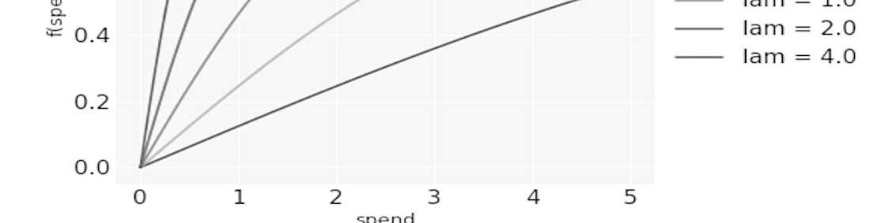
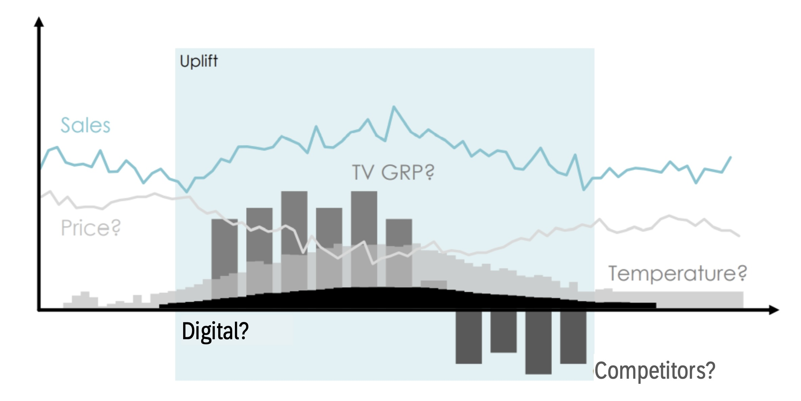
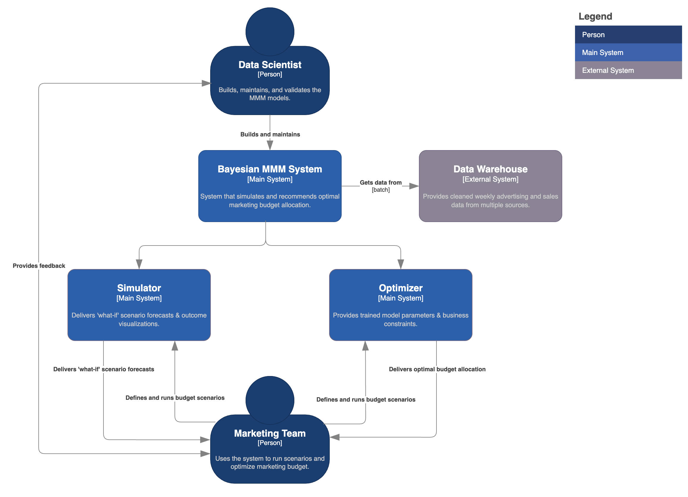

# Bayesian Marketing Mix Modeling for Budget Optimization

  

> An ML system that quantifies the impact of various marketing channels on sales for a top petcare brand. **Objective:** To leverage a Bayesian framework with flexible functional forms to accurately model advertising's lag and saturation effects, quantify uncertainty, and feed these probabilistic insights into a robust optimization engine to maximize portfolio ROI.

### Outline

- [Key Results](#key-results)
- [Overview](#overview)
- [Architecture](#architecture)
- [Dataset](#dataset)
- [Modeling](#modeling)
- [Usage](#usage)
---

## Key Results

| Metric | Result (Posterior Mean) | Description |
| :--- | :--- | :--- |
| 🎯 **Optimal Mix Recommendation** | **15% Budget reallocation** | The model suggested a budget reallocation of 15% from traditional print and linear TV towards Digital Video (YouTube) and Paid Search. |
| 💰 **Projected ROI Uplift** | **+6.7%** (95% CI: 4.5%–8.9%) | This optimized mix increased incremental revenue by an estimated $3.2M per quarter (+6.7% ROI) at the same level of investment. |
| 📈 **Saturation Insights** | Facebook Ads: saturation at **~$75K/wk** | Analysis of saturation curves revealed that spending on Facebook Ads has reached a point of diminishing returns. In contrast, channels like YouTube and influencer marketing showed significant room for growth before saturation. |
| 📊 **Simulation Impact** | **+9%** PFME effectiveness gain| A simulation doubling the Digital Media spend, funded by proportionally cutting other channels, showed a potential +9% gain in PFME effectiveness, though with declining ROIs for the saturated digital channels. |

## Overview

Top petcare brand's marketing team invests in a diverse portfolio of channels, including traditional media (TV, print), digital campaigns (social media, search), and trade promotions (in-store displays, discounts). The complexity of these simultaneous activities makes it difficult to disentangle their individual impact on sales. 

This project implements a Marketing Mix Model (MMM) to quantify the precise contribution of each marketing lever to sales revenue. By understanding the effectiveness and efficiency of past investments, the system provides a robust framework for optimizing future budget allocations to maximize product revenue.

  
   
  <em>Fig. 1: The challenge is to isolate the impact of each activity on sales.</em>

## Architecture

The system is a prescriptive analytics pipeline that translates historical data into an optimal forward-looking strategy. It moves beyond simple prediction to active recommendation by integrating a Bayesian inference core with a consequential optimization engine.

  
   
  <em>Fig. 2: [System Context Diagram] Bayesian Marketing Mix Modeling</em>

## Dataset

This project uses a time-series dataset of weekly sales and marketing activities, including own-brand activities, competitor actions, and control variables.

### Features

| Primary Category | Secondary Category  | Specific Features                                       |
| :--------------- | :------------------ | :------------------------------------------------------ |
| **Media** | Traditional Media   | TV, OOH, Radio, Print                                   |
| **Media** | Digital Media       | YouTube, VOD, Digital Display, Social Media, Search     |
| **Non-Media** | Own Drivers         | Consumer promo, sampling, trade promo                   |
| **Non-Media** | Own Drivers         | Price, Distribution                                     |
| **Non-Media** | Others              | External factors, trends, seasonality                   |
| **Non-Media** | Others              | Competitive price, distribution, trade promotions & media |

`sales_performance` was used as the target variable for the model.

## Modeling

The core of the analysis is a Bayesian regression model that estimates the contribution of each sales driver.

- **Bayesian framework**: Unlike traditional frequentist methods, this approach yielded a full probability distribution for each parameter. This allowed us to quantify uncertainty, for example, by stating there is a "95% probability that the ROI for YouTube is between 2.1 and 2.8."
- **Adstock transformation**: To capture the lagging effect of advertising, media variables were transformed using a geometric decay function. The model learned the optimal decay rate (memory effect) from the data, which indicates how long advertising's impact lingers.
- **Saturation transformation**: To model diminishing returns, the adstocked media variables were passed through a Hill function. This S-shaped curve ensured that the incremental sales impact of an additional "dollar" of advertising spend decreases as the total spend increases.

| Component | Description | Toolkit |
| :--- | :--- | :--- |
| **Bayesian Inference** | A hierarchical Bayesian model estimated the posterior distribution for all parameters, leveraging prior knowledge and capturing a full range of plausible values for each channel's effectiveness. | `PyMC` |
| **Flexible Transformations** | Media carryover (**Adstock**) and **Saturation** effects were modeled as flexible functions whose parameters are learned from the data. | `Python` |
| **Model Selection** | The **Bayesian Information Criterion (BIC)** was used to compare and select the most appropriate functional form specifications for the adstock and saturation effects, balancing model fit and complexity. | `Python` |
| **Budget Optimization** | The posterior distributions of channel ROIs were passed to a numerical optimizer. It solves for the budget allocation that maximizes the expected revenue, subject to a total budget constraint. | `SciPy.optimize` |

## Usage

The primary value of this model is its application in forward-looking strategic planning. The marketing team used the system in two main ways: running "what-if" simulations to explore potential outcomes and using the optimizer to find the single best budget allocation. This allowed them to answer critical business questions and make data-driven decisions.

### 🧪 Simulation

The simulation module allowed the team to test the probable impact of various budget scenarios before committing any funds. This addressed key questions like, "What is the revenue impact of a budget change during the year?". A few examples:

* Scenario 1: **Shifting budget between channels**
    The team simulated reallocating **$1M** from the Print budget to the Digital Video budget for the upcoming quarter. The model predicted that this shift would likely result in a **net increase of +$2.3M** in incremental revenue, confirming that Digital Video had a higher marginal ROI.

* Scenario 2: **Responding to a budget cut**
    When faced with a potential **10% budget cut** mid-year, the team used the simulator to understand the consequences. The model forecasted the likely decrease in sales volume, allowing them to communicate the specific business impact to leadership and plan accordingly.

* Scenario 3: **Planning to meet a revenue target**
    To answer, "How much do I need to invest to meet my revenue target?", the team worked backward. They set a goal of **$15M in incremental revenue** for Q4 and used the model to estimate the total marketing investment required to achieve it, given the current channel mix.

### 🎯 Optimization

While simulation is used for testing specific ideas, the optimization module is used to find the mathematically best budget allocation given a set of constraints. This directly answers the question, "How can I maximize ROI for a given budget?"

Example: **Product launch campaign budget optimization**
    At the start of the campaign planning, the marketing team set a total media budget of **$2M** with the objective of maximizing incremental revenue.
    * **Process:** The optimizer was run with the $2M budget constraint. It processed the learned ROI and saturation curves for every single channel.
    * **Output:** The module delivered a detailed, channel-specific spending plan. This allocation automatically avoided over-investing in channels that were near their saturation point, like Facebook Ads, thereby preventing wasteful spending.
    * **Outcome:** The recommended budget was projected to increase the overall marketing ROI by **+6.7%** compared to the previous year's plan, which was the basis for the **15% budget reallocation** highlighted in the Key Results. The marketing team could explore these results in an interactive dashboard to compare the optimized plan against their initial proposals.

 

> [!WARNING]
> This repository provides a high-level demonstration of the project's architecture and methodology. Certain implementation details and model complexities have been simplified for clarity.

 

🌐 © 2025 t.r.

